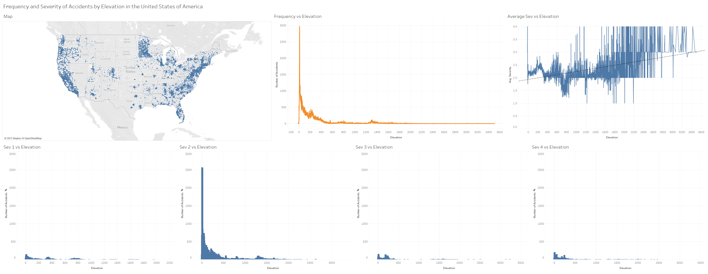
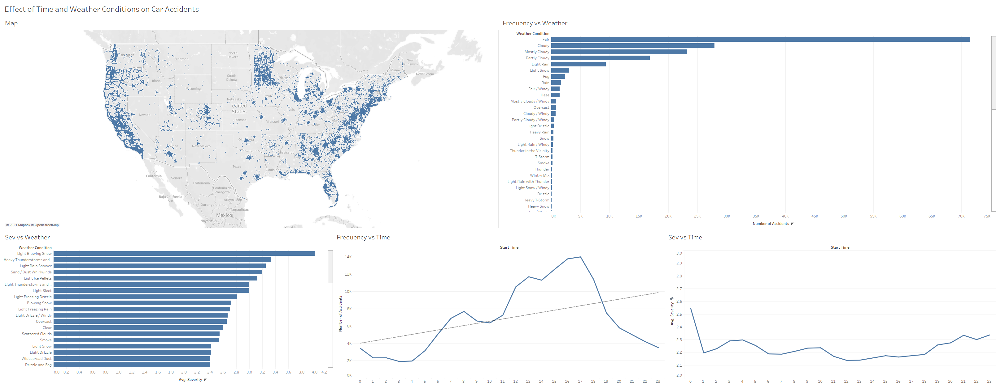
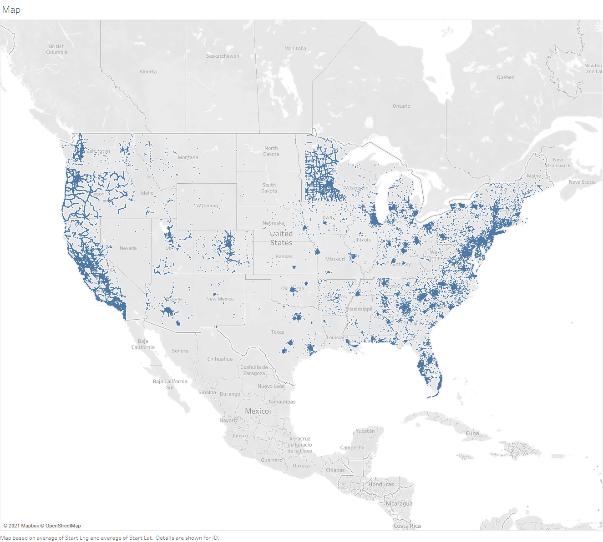

# Dashboard

## Screenshots

### Dashboard to answer Research Question One

The following dashboard displays the data to answer research question one. The map provides locations, elevation, and severity information on all accidents in the dataset. The graphs display the severity trend vs elevation, the frequency of car accidents vs elevation, and lastly, the graphs of severity vs elevation.

### Dashboard to answer Research Question Two

The following dashboard displays the data to answer research question two. The map provides locations, elevation, and severity information on all accidents in the dataset. The graphs demonstrate the frequency of accidents by weather conditions, and the severity of accidents by weather conditions. Furthermore, it displays the sevrity and frequency of car accidents by time of day.

### Individual sheets for the dashboard

#### Map

The following map displays the locations of the car accidents as well as the elevation, severity, and accident ID of each accident.

#### Dashboard One Sheets

The following sheet displays the Frequency vs elevation graph of the car accidents. It demeonsrates the effect of elevation on the frequency of car accidents.

The following sheet displays the average severity per elevation. It displays an upwards trend of severity as the elevation increases.

The following sheet displays the number of accidents at a severity of one vs elevation. It displays the frequency of car accidents by severity vs elevation.

The following sheet displays the number of accidents at a severity of two vs elevation. It displays the frequency of car accidents by severity vs elevation.

The following sheet displays the number of accidents at a severity of three vs elevation. It displays the frequency of car accidents by severity vs elevation.

The following sheet displays the number of accidents at a severity of four vs elevation. It displays the frequency of car accidents by severity vs elevation.

#### Dashboard Two Sheets

The following sheet displays the frequency of car accidents by weather conditions. It demonstrates the effect of weather conditions on the frequency of car accidents.

The following sheet displays the average severity of car accidents by weather conditions. It demonstrates the effect of weather conditions on the severity of car accidents.

The following sheet displays the frequency of car accidents by time of day. It demonstrates the effect of time of day on the frequency of car accidents.

The following sheet displays the average severity of car accidents by time of day. It demonstrates the effect of time of day on the severity of car accidents.

